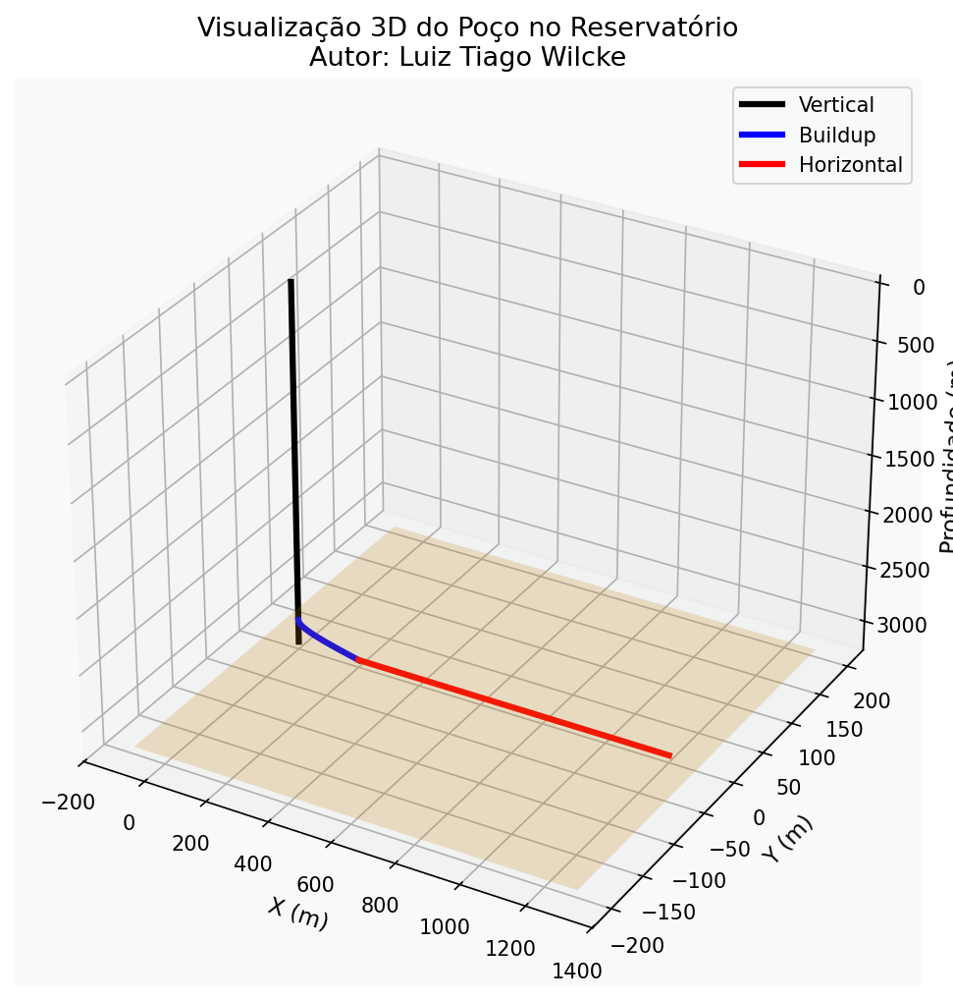
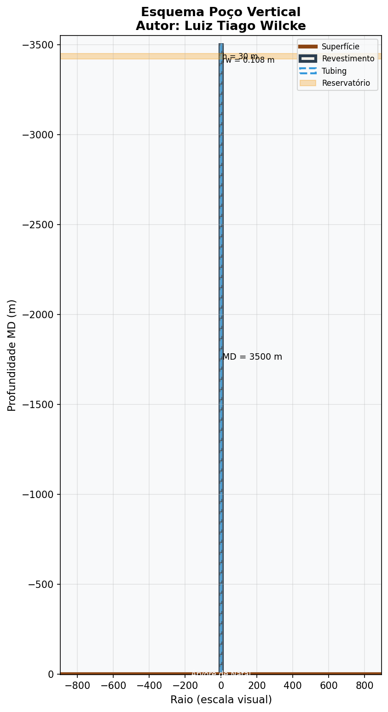

# 🛢️ Redes Neurais Informadas pela Física — Volume 3

### Engenharia de Petróleo e Poços

<p align="center">
  
</p>

<p align="center">
  <b>Autor: Luiz Tiago Wilcke</b><br/>
  Bacharel em Estatística · Especialista em Deep Learning Científico e Engenharia de Petróleo<br/>
  <i>VOLUME III — Computação Neural Aplicada à Subsuperfície</i>
</p>

<p align="center">
  
  
  
  
  
</p>

---

## 📖 Sobre o Projeto

Sistema modular completo de **25 módulos** que implementa **Physics-Informed Neural Networks (PINNs)** para modelagem avançada de poços de petróleo, baseado no livro:

> **Redes Neurais Informadas pela Física**  
> Volume 3: Dinâmica Multifásica, Sistemas de Elevação Artificial e Completações Inteligentes

O framework combina equações diferenciais parciais da física de reservatórios com redes neurais, permitindo:

- Simulação de escoamento monofásico e multifásico
- Otimização de elevação artificial (Gas Lift, BCS, BM)
- Completações inteligentes (ICVs / ICDs)
- Problemas inversos e quantificação de incerteza (B-PINNs)
- Geomecânica, fluidos não-newtonianos, operadores neurais e muito mais

---

## 🧮 Equações Fundamentais

### 1. Grau API e Densidade

$$
^\circ\mathrm{API} = \frac{141{,}5}{SG} - 131{,}5 \qquad,\qquad SG = \frac{\rho_{\mathrm{óleo}}}{\rho_{\mathrm{água}}}
$$

### 2. Lei de Darcy (forma vetorial)

$$
\mathbf{u} = -\frac{\mathbf{K}}{\mu}\bigl(\nabla P - \rho\mathbf{g}\bigr)
$$

### 3. Equação de Forchheimer (fluxo não-Darcy)

$$
-\frac{\partial P}{\partial x} = \frac{\mu}{k}u + \beta_F\rho\,u|u|
$$

### 4. Porosidade compressível

$$
\phi(P) = \phi_0\,\exp\bigl[c_f(P-P_0)\bigr]
$$

### 5. Equação Geral da Difusividade (meios anisotrópicos)

$$
\nabla\cdot\left(\frac{\mathbf{K}}{\mu}\nabla P\right) = \phi\,c_t\frac{\partial P}{\partial t} + \frac{q}{\rho_{\mathrm{std}}}
$$

### 6. Solução radial estacionária (Dupuit)

$$
P(r) = P_{wf} + \frac{P_e - P_{wf}}{\ln(r_e/r_w)}\ln\left(\frac{r}{r_w}\right)
$$

$$
Q = \frac{2\pi kh(P_e - P_{wf})}{\mu\ln(r_e/r_w)}
$$

### 7. Buckley–Leverett (fração de fluxo e transporte)

$$
f_w(S_w) = \frac{1}{1 + \dfrac{k_{ro}(S_w)\,\mu_w}{k_{rw}(S_w)\,\mu_o}}
$$

$$
\frac{\partial S_w}{\partial t} + \frac{u_t}{\phi}\frac{\mathrm{d}f_w}{\mathrm{d}S_w}\frac{\partial S_w}{\partial x} = 0
$$

### 8. Histerese de Killough + Land

$$
S_{gt} = \frac{S_{g,hy}}{1 + C_{\mathrm{Land}}S_{g,hy}}
$$

$$
k_{rg}^{\mathrm{imb}}(S_g) = k_{rg}^{\mathrm{dr}}(S_{g,hy})\left(\frac{S_g - S_{gt}}{S_{g,hy} - S_{gt}}\right)^\alpha
$$

### 9. Equação de Estado de Peng–Robinson

$$
P = \frac{RT}{V_m - b} - \frac{a(T)}{V_m(V_m + b) + b(V_m - b)}
$$

$$
a_i(T) = \Omega_a\frac{R^2T_{c,i}^2}{P_{c,i}}\alpha_i(T_{r,i},\omega_i) \qquad,\qquad b_i = \Omega_b\frac{RT_{c,i}}{P_{c,i}}
$$

### 10. Gradiente de pressão vertical (poço)

$$
\frac{\mathrm{d}P}{\mathrm{d}z} = \underbrace{\rho_m g\cos\theta}_{\text{gravitacional}} + \underbrace{\frac{f\rho_m u|u|}{2D}}_{\text{friccional}} + \underbrace{\rho_m u\frac{\mathrm{d}u}{\mathrm{d}z}}_{\text{acelerativo}}
$$

### 11. Função de perda multiobjetivo da PINN

$$
\mathcal{L}(\boldsymbol{\theta}) = w_{\mathrm{data}}\mathcal{L}_{\mathrm{data}} + w_{\mathrm{phys}}\mathcal{L}_{\mathrm{phys}} + w_{\mathrm{bc}}\mathcal{L}_{\mathrm{bc}}
$$

$$
\mathcal{L}_{\mathrm{phys}} = \frac{1}{N_{\mathrm{col}}}\sum_{i=1}^{N_{\mathrm{col}}}\bigl|R\bigl(\hat{u}_{\boldsymbol{\theta}}(x_i,t_i)\bigr)\bigr|^2
$$

### 12. Tensor de permeabilidade anisotrópica

$$
\mathbf{K} = \begin{pmatrix} k_{xx} & k_{xy} & k_{xz} \\ k_{yx} & k_{yy} & k_{yz} \\ k_{zx} & k_{zy} & k_{zz} \end{pmatrix}
$$

### 13. Equação de onda de Gibbs (bombeio mecânico)

$$
\frac{\partial^2 u}{\partial t^2} = c^2\frac{\partial^2 u}{\partial x^2} - \alpha\frac{\partial u}{\partial t}
$$

### 14. Herschel–Bulkley (fluido não-newtoniano)

$$
\tau = \tau_0 + K\,\dot{\gamma}^n
$$

### 15. Poroelasticidade de Biot (tensão efetiva)

$$
\boldsymbol{\sigma}' = \boldsymbol{\sigma} - \alpha_{\mathrm{Biot}}\,P\,\mathbf{I}
$$

### 16. Critério de Mohr–Coulomb

$$
\mathrm{FS} = \frac{2c\cos\phi + (\sigma_1+\sigma_3)\sin\phi}{\sigma_1-\sigma_3}
$$

### 17. Tensões de Kirsch (concentração ao redor do poço)

$$
\sigma_{\theta\theta} = (\sigma_H+\sigma_h) - 2(\sigma_H-\sigma_h)\cos 2\theta - P_w
$$

---

## 🗂️ Estrutura do Repositório

```text
PINN_Petroleo_Wilcke_Volume3/
├── README.md                 ← este arquivo
├── EQUACOES.md               ← catálogo completo de equações
├── requirements.txt
├── setup.py
├── main.py
├── executar_demo.py
├── config/
│   └── configuracoes.py
├── utils/
│   └── utilitarios.py
├── visualizacao/
│   └── imagem_poco.py
├── modulos/
│   ├── modulo01_fundamentos.py
│   ├── modulo02_escoamento_vertical.py
│   ├── ... (25 módulos)
│   └── modulo25_sismica.py
├── figuras/
│   ├── poco_vertical.png
│   └── poco_3d.png
└── docs/
```

### 25 Módulos

| # | Módulo | Tema |
|---|--------|------|
| 01 | Fundamentos | Darcy, Difusividade, Buckley-Leverett, Peng-Robinson |
| 02 | Escoamento Vertical | Gradientes, Two-Fluid Model, energia térmica |
| 03 | Arquitetura PINN | Perda multiobjetivo, MAP, viés-variância |
| 04 | Anisotropia | Tensor K, inversão, TV, B-PINN |
| 05 | Elevação Artificial | Gas Lift, BCS, equação de Gibbs |
| 06 | Poço Inteligente | ICVs, ICDs, DAE, acoplamento |
| 07 | Problemas Inversos | History Matching, HMC, VI |
| 08 | Não-Newtoniano | Power-law, Bingham, Herschel-Bulkley, Oldroyd-B |
| 09 | Geomecânica | Biot, Mohr-Coulomb, Kirsch, fraturamento |
| 10 | Operadores Neurais | DeepONet, FNO, PINO, U-NO |
| 11 | Severe Slugging | Pipeline-Riser-FPSO |
| 12 | XPINNs | Decomposição de domínio |
| 13 | Multifidelidade | Mote-DeepONet |
| 14 | THMC | Acoplamento termo-hidro-mecânico-químico |
| 15 | PIRL | Reinforcement Learning informado pela física |
| 16 | Trans-FNO | Fourier Neural Operator transiente |
| 17 | PI-GNNs | Graph Neural Networks para redes de superfície |
| 18 | Pré-Sal | Aplicações Bacia de Santos |
| 19 | Composicional | Peng-Robinson HPHT, fugacidade |
| 20 | Fluência de Sal | Norton-Bailey |
| 21 | Wormholes | Transporte reativo e acidização |
| 22 | Drift-Flux | Modelo bifásico com inclinação |
| 23 | Swelling | Termo-chemo-poroelasticidade de folhelhos |
| 24 | Eletromagnético | Maxwell, corrosão de casing |
| 25 | Sísmica VTI | Ondas anisotrópicas e FWI |

---

## 🚀 Instalação e Uso

```bash
# Entrar na pasta
cd PINN_Petroleo_Wilcke_Volume3

# Dependências
pip install -r requirements.txt

# Demonstração rápida
MPLBACKEND=Agg python executar_demo.py
```

### Exemplo mínimo

```python
from config.configuracoes import FISICA, GEOMETRIA, resumo_configuracoes
from utils.utilitarios import resumo_dimensoes_poco
from modulos.modulo01_fundamentos import FundamentosReservatorio

print(resumo_configuracoes())

fund = FundamentosReservatorio()
print(fund.resumo())
print("Vazão Dupuit (m³/d):", fund.vazao_dupuit(FISICA.pressao_inicial, 15e6) * 86400)
```

---

## 🖼️ Visualização do Poço

| Vertical | 3D |
|----------|-----|
|  |  |

O módulo `visualizacao` gera automaticamente esquemas de:

- Poço vertical com revestimento e tubing
- Poço horizontal / direcional
- Completação inteligente (ICVs + ICDs)
- Visualização 3D no reservatório

---

## 📚 Referência

**Luiz Tiago Wilcke**  
*Redes Neurais Informadas pela Física — Volume 3*  
Engenharia de Petróleo e Poços  
Dinâmica Multifásica, Sistemas de Elevação Artificial e Completações Inteligentes

---

<p align="center">
  <b>© Luiz Tiago Wilcke</b><br/>
  Computação Neural Aplicada à Subsuperfície
</p>
